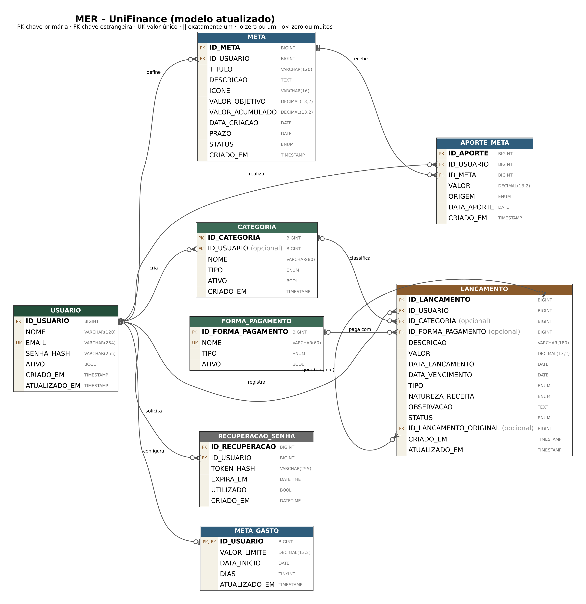
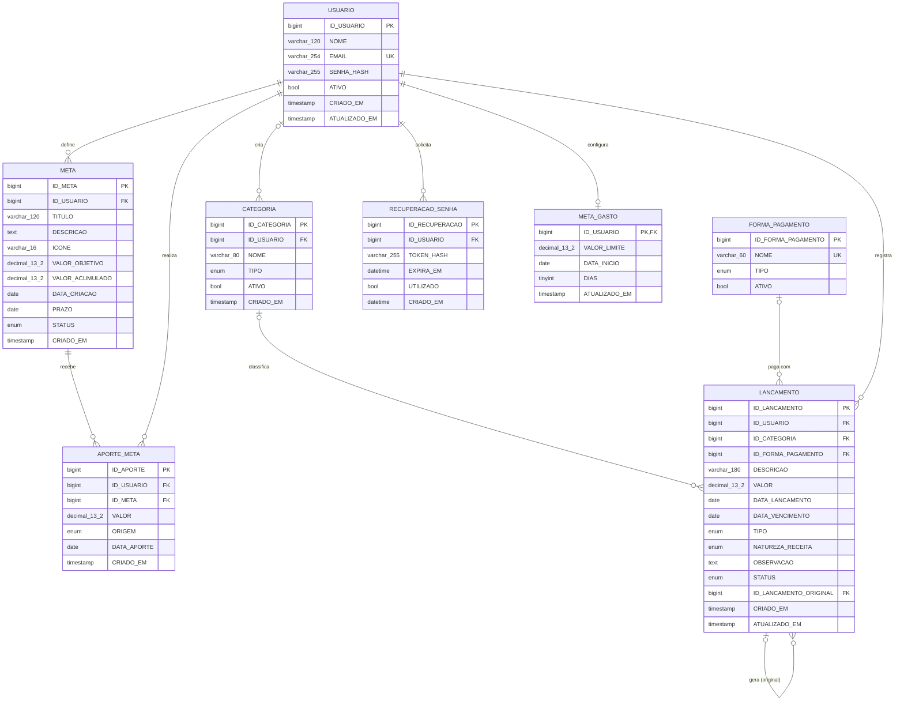

# MER – UniFinance (modelo atualizado)

Gerado a partir de `SQL/sistema_financeiro.sql`.

## Diagrama (Mermaid)

```mermaid
erDiagram
    META ||--o{ APORTE_META : "recebe"
    USUARIO ||--o{ APORTE_META : "realiza"
    USUARIO |o--o{ CATEGORIA : "cria"
    CATEGORIA |o--o{ LANCAMENTO : "classifica"
    FORMA_PAGAMENTO |o--o{ LANCAMENTO : "paga com"
    LANCAMENTO |o--o{ LANCAMENTO : "gera (original)"
    USUARIO ||--o{ LANCAMENTO : "registra"
    USUARIO ||--o{ META : "define"
    USUARIO ||--o{ RECUPERACAO_SENHA : "solicita"
    USUARIO ||--o| META_GASTO : "configura"
    APORTE_META {
        bigint ID_APORTE PK
        bigint ID_USUARIO FK
        bigint ID_META FK
        decimal_13_2 VALOR
        enum ORIGEM
        date DATA_APORTE
        timestamp CRIADO_EM
    }
    CATEGORIA {
        bigint ID_CATEGORIA PK
        bigint ID_USUARIO FK
        varchar_80 NOME
        enum TIPO
        bool ATIVO
        timestamp CRIADO_EM
    }
    FORMA_PAGAMENTO {
        bigint ID_FORMA_PAGAMENTO PK
        varchar_60 NOME UK
        enum TIPO
        bool ATIVO
    }
    LANCAMENTO {
        bigint ID_LANCAMENTO PK
        bigint ID_USUARIO FK
        bigint ID_CATEGORIA FK
        bigint ID_FORMA_PAGAMENTO FK
        varchar_180 DESCRICAO
        decimal_13_2 VALOR
        date DATA_LANCAMENTO
        date DATA_VENCIMENTO
        enum TIPO
        enum NATUREZA_RECEITA
        text OBSERVACAO
        enum STATUS
        bigint ID_LANCAMENTO_ORIGINAL FK
        timestamp CRIADO_EM
        timestamp ATUALIZADO_EM
    }
    META {
        bigint ID_META PK
        bigint ID_USUARIO FK
        varchar_120 TITULO
        text DESCRICAO
        varchar_16 ICONE
        decimal_13_2 VALOR_OBJETIVO
        decimal_13_2 VALOR_ACUMULADO
        date DATA_CRIACAO
        date PRAZO
        enum STATUS
        timestamp CRIADO_EM
    }
    RECUPERACAO_SENHA {
        bigint ID_RECUPERACAO PK
        bigint ID_USUARIO FK
        varchar_255 TOKEN_HASH
        datetime EXPIRA_EM
        bool UTILIZADO
        datetime CRIADO_EM
    }
    USUARIO {
        bigint ID_USUARIO PK
        varchar_120 NOME
        varchar_254 EMAIL UK
        varchar_255 SENHA_HASH
        bool ATIVO
        timestamp CRIADO_EM
        timestamp ATUALIZADO_EM
    }
    META_GASTO {
        bigint ID_USUARIO PK,FK
        decimal_13_2 VALOR_LIMITE
        date DATA_INICIO
        tinyint DIAS
        timestamp ATUALIZADO_EM
    }
```
